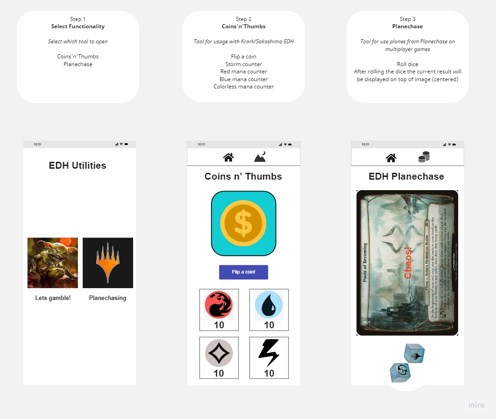

# EDH_utils

## Name
EDH Utilities

## Description
Project to learn Android mobile development using Kotlin.
This is my first project and i want to create a app to help me when playing Magic the gathering.
The purpose of this app is:
 - Support the Krark/Sakashima Storm deck with functionalities that can help track the resources generated;
 - Support Planechasing modifier on EDH multiplayer games. 

## Visuals
There is a sample for the project, just for knowing the purpose of the project.

## Support
Any sugestions ? Send me a email!
<mailto:diegoengcontrole@gmail.com>

## Authors and acknowledgment
Main author: Diego dos Santos Coutinho

## Project status
After the first release, i'll try to create better frontend and maybe implement some new funcionalities!
